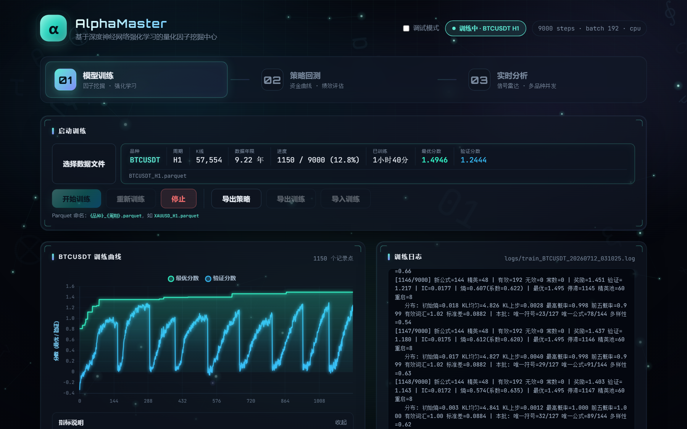
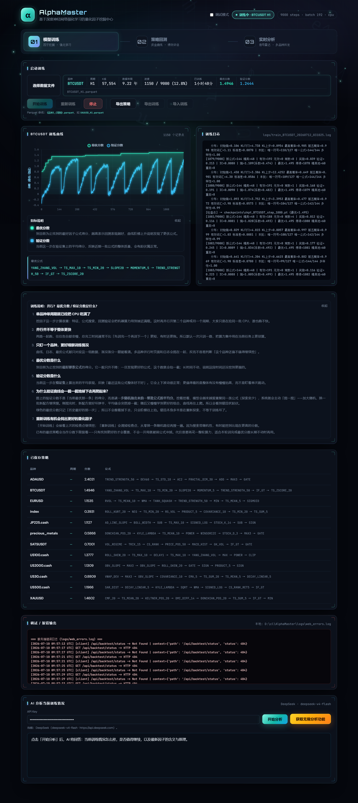
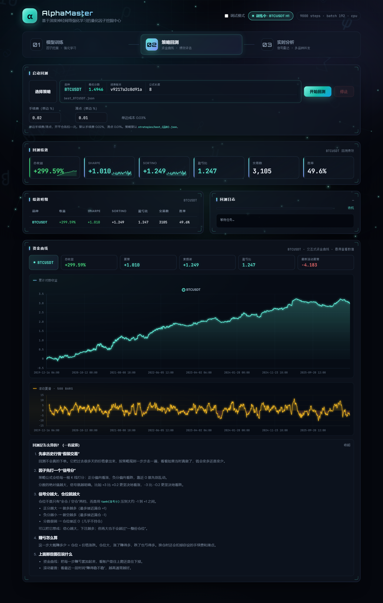
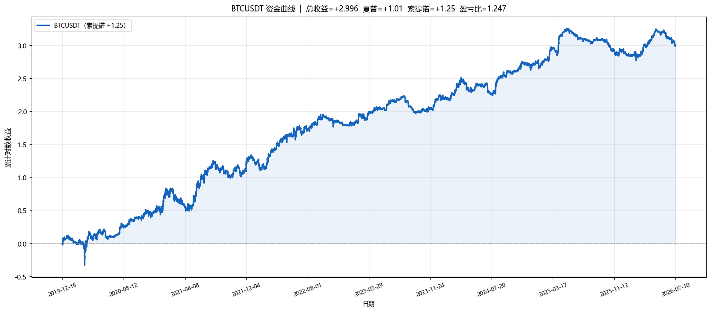
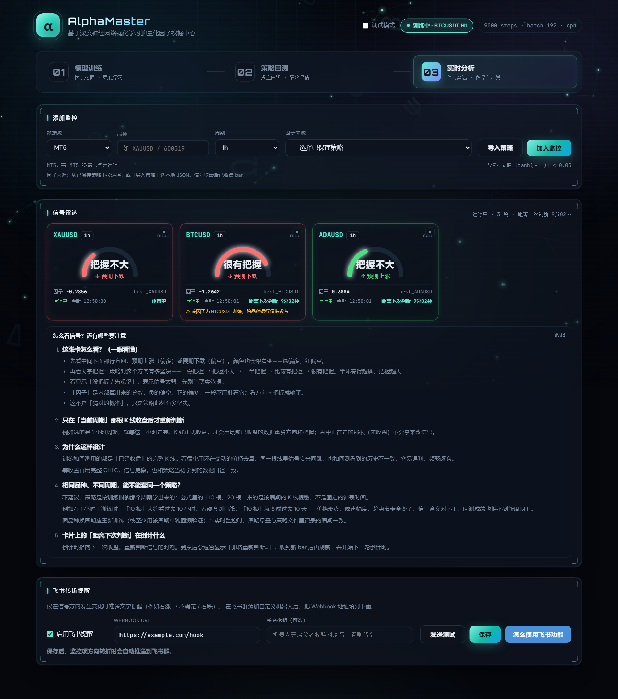

# AlphaMaster

基于深度神经网络强化学习的量化因子挖掘中心：从 Parquet / MT5 K 线自动搜索可解释因子公式，支持 Web 端训练、回测与实时信号分析。

[](LICENSE)



仓库地址：[github.com/rosemarycox5334-debug/AlphaMaster](https://github.com/rosemarycox5334-debug/AlphaMaster)

---

## 它做什么

AlphaMaster 把「挖因子」做成一条可操作的流水线：

1. **训练**：用强化学习在特征 + 算子空间里搜索公式，按验证集表现选优  
2. **回测**：用 `tanh(因子)` 连续仓位在历史行情上模拟交易，看资金曲线与绩效  
3. **实时分析**：按周期收盘后重算信号，展示方向与把握；方向转折可推飞书提醒  

公式以 token 序列保存（如 `strategies/best_BTCUSDT.json`），可用 StackVM 解释执行，训练 / 回测 / 实时共用同一套信号逻辑。

---

## Web 控制台（推荐入口）

```bash
pip install -r requirements.txt
python run_web.py --port 8765
```

浏览器打开 [http://127.0.0.1:8765](http://127.0.0.1:8765)。界面分三步：

| 步骤 | 作用 |
|------|------|
| **01 模型训练** | 选 Parquet、开始 / 重新训练、看曲线与日志、导出策略与检查点 |
| **02 策略回测** | 选策略 JSON，设手续费 / 滑点，看绩效与资金曲线 |
| **03 实时分析** | 多数据源监控，收盘后更新信号；可选飞书转折提醒 |

### 模型训练



- Parquet 命名：`{品种}_{周期}.parquet`，例如 `BTCUSDT_H1.parquet`、`XAUUSD_H1.parquet`  
- **开始训练**：有检查点则断点续训  
- **重新训练**：清除检查点从头搜索；已有更优策略作为分数下限，不会被弱结果覆盖  
- 展示最优分数、验证分数、训练曲线与最优公式；可选 AI 分析当前训练情况  

### 策略回测



- 仓位：`position = tanh(factor)`，信号越强仓位越大  
- 成本：手续费 + 滑点（默认约 0.02% / 0.01%）  
- 输出：总收益、夏普、索提诺、盈亏比、滚动夏普与资金曲线  



### 实时分析



- 数据源：MT5 / OKX 等（以界面可用源为准）  
- **只在当前周期 K 线收盘后**重新判断；未收盘 bar 不参与信号  
- 卡片展示方向（看涨 / 看跌 / 不确定）与把握程度  
- 可选飞书 Webhook：仅在方向转折时推送文字提醒  

---

## 项目结构

```
AlphaMaster/
├── web/                 # FastAPI Web UI（训练 / 回测 / 实时）
├── model_core/          # 特征、算子、StackVM、训练引擎、回测评分
├── data_pipeline/       # Parquet / MT5 K 线加载与对齐
├── strategy_manager/    # 实盘信号与仓位逻辑（与回测口径一致）
├── execution/           # MT5 下单接口
├── backtest_viz/        # 回测引擎与图表
├── strategies/          # best_{symbol}.json 策略文件
├── checkpoints/         # 训练检查点
├── run_web.py           # 启动 Web 控制台
├── train_file.py        # CLI：从单个 Parquet 训练
└── requirements.txt
```

---

## 环境要求

- Python **3.10+**（建议 3.11）  
- PyTorch、pandas、FastAPI、uvicorn 等（见 `requirements.txt`）  
- 可选：MetaTrader 5 终端（实时 MT5 源 / 实盘相关脚本）  
- 复制 `.env.example` 为 `.env` 填写 MT5 等凭证（`.env` 已 gitignore）  

```bash
pip install -r requirements.txt
# 可选可视化等：pip install -r requirements-optional.txt
```

---

## 常用命令

```bash
# Web 控制台
python run_web.py --port 8765

# CLI 训练（自动续训；加 --from-scratch 则重新训练）
python train_file.py --data-file D:\K线数据\BTCUSDT_H1.parquet
python train_file.py --data-file D:\K线数据\BTCUSDT_H1.parquet --from-scratch
```

策略输出默认在 `strategies/best_{symbol}.json`。

---

## 信号口径（训练 / 回测 / 实时一致）

- 因子经 StackVM 算出标量序列  
- `position = tanh(factor)` ∈ (-1, 1)  
- `|position|` 小于阈值时视为无信号（观望）  
- 实时侧只用**已收盘** K 线，避免盘中抖动与回测不一致  

---

## 截图更新

仓库内展示图由当前 Web UI 截取，可用：

```bash
python scripts/capture_readme_shots.py
```

（需本机已启动 `python run_web.py --port 8765`，并已安装 Playwright + Chromium。）

---

## License

本项目采用 [GNU Affero General Public License v3.0 (AGPL-3.0)](LICENSE)。  
修改、分发或通过网络提供服务时，须按相同协议公开对应源代码。

---

## Star History

[](https://www.star-history.com/#rosemarycox5334-debug/AlphaMaster&type=date&legend=top-left)
